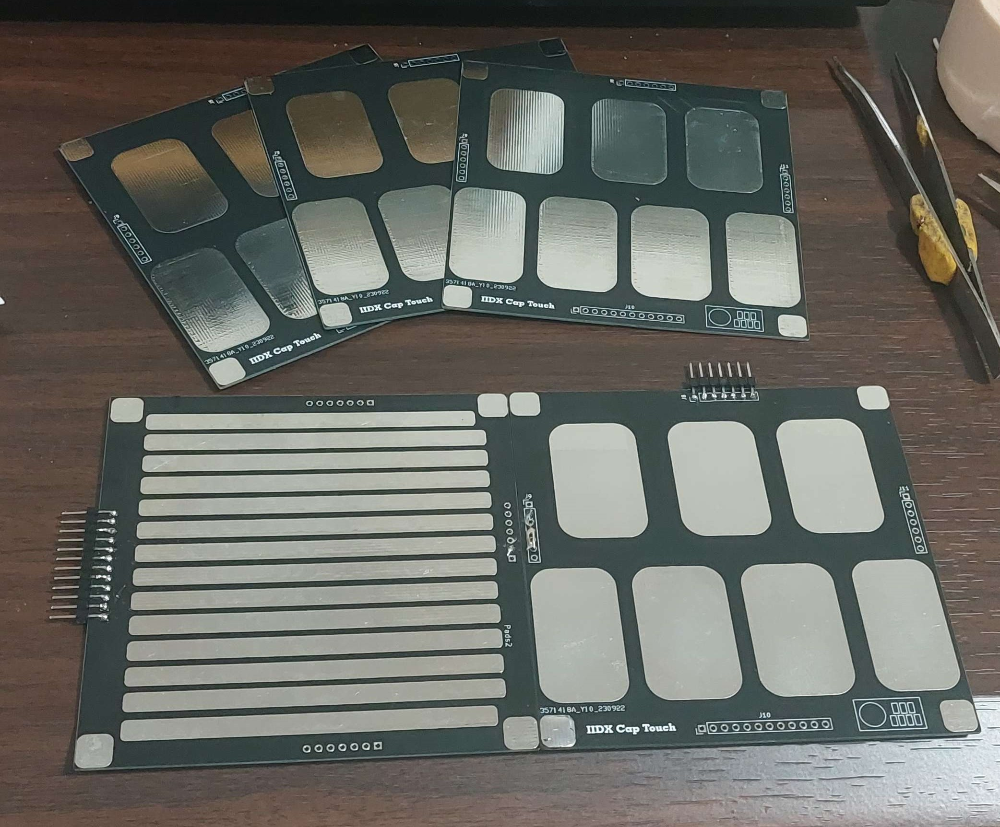
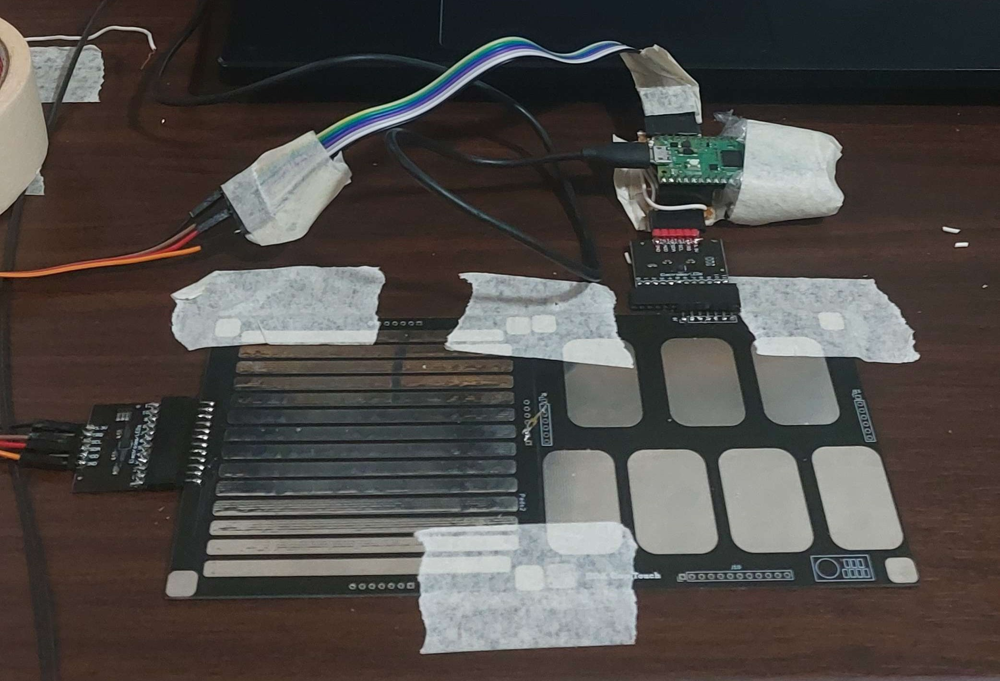

# iidx-cap-touch
Beatmania IIDX Capacitive Touch Controller

## PCB 2

Usage
1. Connect 1 MPR121 to a RPi Pico
    - Can extend with an additional MPR121 port
2. Top left (thin) pad can act as turntable button - Or you can use PCB 1 with an additional MPR121 for a turntable
3. CircuitPython on the RPi Pico allows you to configure keybindings
4. Should Tapedown the controller to prevent sliding - cap touch + pcb + tapedown = minimal noise

Ordering
1. Both PCBs in the picture are using the same design - Can order 1 pack of 5 for $2 + $2 for 2 weeks shipping
2. Connect them together through headers/ wires

## PCB 1

1. Connect 2 MPR121 to a Raspberry Pi Pico, each on different I2C buses
2. CircuitPython Code to simulate a turntable (still a bit wonky, but usable for simple maps)
3. PCB controller for ease of use. 5 costs $2 + $2 shipping in 10 days or so.

